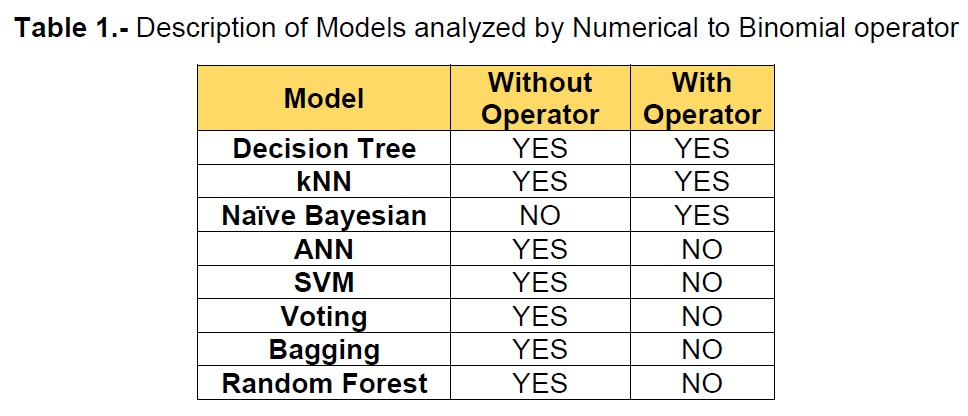
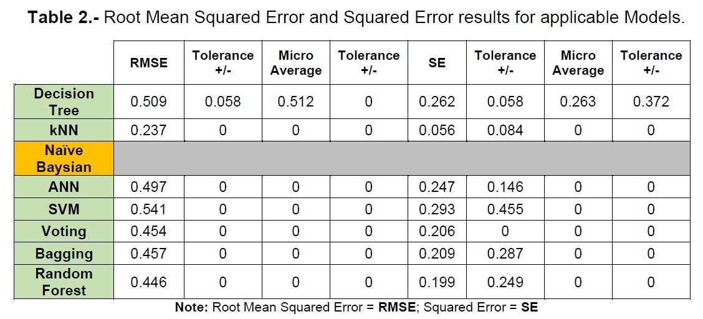
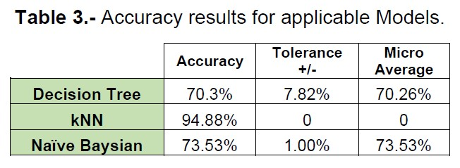

# Data Mining and Decision Analysis based on Haberman's Data

The attached Haberman's dataset (*HabermansSurvivalData.xlsx*) contains cases from a study that was conducted between 1958 and 1970 at the University of Chicago's Billings Hospital on the survival of patients who had undergone surgery for breast cancer.

# Data

This data set is named **"Haberman's Survival Data"** because it was first used in a research paper by S. J. Haberman.

This data set has 306 records. The following are the attributes.

•	***Age of patient at time of operation (numerical)***

•	***Patient's year of operation (year - 1900, numerical)***

•	***Number of positive axillary nodes detected (numerical)***

− Survival status (class attribute)

•	***1 = the patient survived 5 years or longer***

•	***2 = the patient died within 5 year***

# Objective

The objective of the project is to find the best performing classification model to predict if a patient will survive five years or longer after the surgery.

# Response

The data set named "Haberman's Survival Data" was analyzed using the following models: 

•	***Decision tree***

•	***kNN***

•	***Naive Bayesian***

•	***ANN***

•	***SVM***

•	***Ensemble learners (Voting, Bagging and Random Forest)***

Some of the models were analyzed using the numerical to binomial operator as allowed by Rapid Miner. Others were analyzed without the numerical to binomial operator. A detailed list of what operators were analyzed in each case is presented in Table 1.

Analysis for each of the models was applied using Rapid Miner Table 2 and Table 3 present the corresponding results for each of the models. Table 2 presents a compilation of each of the Root Mean Squared Error (RMSE) and Squared Error (SE) results with tolerances and Micro averages for each of the applicable models.

Table 3 presents the results for the accuracy value for each of the Decision Tree, kNN, and Naïve Bayesian models. All accuracy results are provided with tolerances and Micro averages if available.

According to the analysis performed the kNN model was the best performing model as it has the lowest values for RMSE and SE. The kNN’s RMSE value was 0.237 and the SE value was 0.056 with a tolerance of +/- 0.084. The kNN’s accuracy was the highest with a value of 94.88%.

